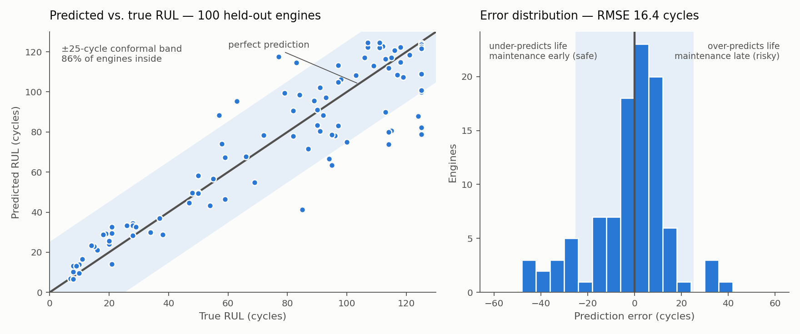

# Predictive Maintenance for Rotating Equipment

Remaining-useful-life (RUL) estimation on NASA's C-MAPSS turbofan degradation
benchmark, with calibrated prediction intervals and a cost-aware maintenance
decision layer.

A point estimate of "this engine has 40 cycles left" is not actionable on its own
— a planner needs to know how wrong that number can be, and what it costs to act
on it. This project produces a *maintenance window* rather than a number, and
then converts that window into a schedule-or-defer decision under an explicit
cost model.



## Results

Measured on the 100 held-out FD001 test engines. Reproduced identically across
three runs at seed 42; the full console output is in [`results/run.log`](results/run.log).

| Metric | Value |
|---|---|
| Test RMSE | **16.4 cycles** |
| NASA asymmetric score | **415** |
| Conformal interval | ±25 cycles |
| Empirical coverage | **86%** (90% nominal) |
| Unplanned failures, model policy | **4** of 100 engines |
| Unplanned failures, best fixed interval | 47 of 100 engines |
| Total cost vs. fixed interval | **50% lower** (at a 100:1 failure cost ratio) |

## Method

Sensor readings go through a three-state Gaussian HMM that infers a latent health
state — healthy, degrading, critical — without any degradation labels. The
posterior over those states is appended to the engineered feature set, so the
sequence model receives an explicit estimate of *where in its life* the engine
currently sits rather than having to infer it from raw sensor levels.

Features are rolling means, EWMA trends, and per-unit drift from each engine's
own first five cycles, which absorbs the unit-to-unit manufacturing variation
C-MAPSS deliberately injects. Seven of the 21 sensors are constant in FD001 and
are dropped, leaving 14 informative channels and 59 features in total.

A two-layer bidirectional LSTM over 30-cycle windows regresses cycles-to-failure.
RUL targets are clipped at 125 cycles — the standard piecewise-linear convention
for this benchmark, which reflects that degradation is not observable early in an
engine's life, so the first stretch of any trajectory carries no usable signal
about how much life remains.

Intervals come from split conformal prediction on a *unit-disjoint* calibration
split: 20 engines are held out whole, so no window from a calibration engine ever
appears in training. Splitting at the window level instead would leak, because
consecutive windows from one engine overlap by 29 of 30 cycles.

The decision layer schedules maintenance at the lower conformal bound and is
scored against the best single fixed interval, tuned on the calibration engines
rather than on test so the baseline is fair rather than hobbled.

## Two honest caveats

**Coverage lands at 86%, not the nominal 90%.** This is a property of how C-MAPSS
is built, not a bug in the calibration. Conformal guarantees require
exchangeability between calibration and test data; here the calibration windows
come from engines observed to failure, while each test engine is truncated at an
arbitrary cycle. Reweighting the calibration set to match the test RUL
distribution moves coverage only to 87%, which confirms the gap is structural.
Treat ±25 cycles as an empirically-86% window.

**The 50% cost reduction depends on an assumed cost ratio.** The model prices one
unplanned failure at 100× the cost of discarding one good cycle of life. That is
defensible for turbomachinery but it is an assumption, not something the data
supplies. The comparison is sensitive to it:

| Failure : early-swap ratio | Cost vs. fixed interval |
|---|---|
| 10:1 | model is 194% *worse* |
| 25:1 | model is 20% worse |
| 50:1 | 38% better |
| 100:1 | 50% better |
| 200:1 | 55% better |

Below roughly 50:1 the cheapest policy is to let engines run to failure, and no
predictive model beats that. Quote the ratio whenever you quote the result.

## Running it

```bash
pip install -r requirements.txt
python rul_pipeline.py --data-dir data/CMAPSSData
python make_figure.py          # regenerates the README figure from results/preds.npz
```

About ten minutes on CPU for 25 epochs. `--epochs` and `--alpha` (the conformal
miscoverage level) are the two flags worth changing.

## Layout

```
rul_pipeline.py          full pipeline: load → HMM → LSTM → conformal → cost layer
make_figure.py           renders results/predicted_vs_actual.png from saved arrays
data/CMAPSSData/         FD001 train/test/RUL files (NASA, public domain)
results/run.log          console output of the run the table above reports
results/preds.npz        saved predictions, for re-analysis without retraining
```

## Data

NASA Turbofan Engine Degradation Simulation (C-MAPSS), FD001 subset: 100 training
engines run to failure, 100 test engines truncated before failure, one operating
condition, one fault mode (HPC degradation).

> A. Saxena, K. Goebel, D. Simon, and N. Eklund, "Damage Propagation Modeling for
> Aircraft Engine Run-to-Failure Simulation," *1st International Conference on
> Prognostics and Health Management (PHM08)*, Denver CO, Oct 2008.

## Possible extensions

FD002 and FD004 add six operating conditions, which breaks the single global
scaler used here and needs condition-wise normalization. FD003 adds a second
fault mode, which is the natural test of whether the HMM states are capturing
degradation or just memorizing one failure signature.
